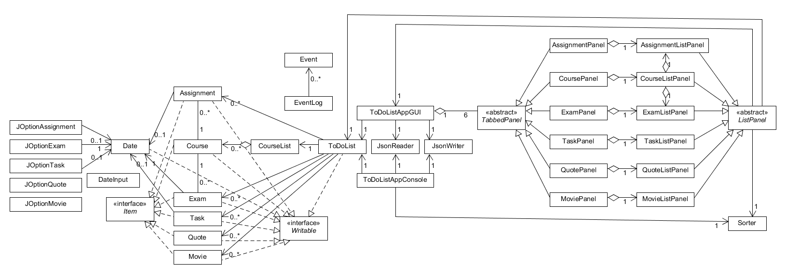

# My To-Do List
### Or: How I learned to stop worrying and keep track of things

A to-do list tailor-made for me, myself, and I. The completed application should keep track of various things I should
get to (along with lighter stuff to brighten the day), while also maintaining various metrics about it for easier
digestion and perhaps retroactive perusal.

The application will keep track of:
- Assignments (and due dates)
- Examination dates
- Inspiration quotes
- Movie watch list
- Miscellaneous tasks

I'm making this project as an upgrade to my current minimalist method of maintaining my to-dos 
(it is *definitely not* just a .txt file). Having a more formalized system for keeping track of my tasks
would be a real benefit to **everything**.

This application will be used by myself, but it's available if you or anyone would like to use it!

### User Stories
- I want to be able to add items to my to-do list
- I want to be able to edit items on my to-do list
- I want to be able to delete items from my to-do list
- I want to be able to see the items on my to-do list organized based on subject and due date
- I want to be able to view items for specific subjects
- I want to be able to save my to-do list to file
- I want to be able to be able to load my to-do list from file

### Phase 4: Task 2
```
Tue Nov 23 13:44:51 PST 2021
Added Course to to-do list
Tue Nov 23 13:44:59 PST 2021
Added Assignment to to-do list
Tue Nov 23 13:45:06 PST 2021
Added Exam to to-do list
Tue Nov 23 13:45:13 PST 2021
Removed Assignment from to-do list
Tue Nov 23 13:45:15 PST 2021
Saved to-do list to file
```

### Phase 4: Task 3

While the UML diagram is quite large, it is mostly elegant in its design and devoid of unnecessary associations.
However, there are some parts that would benefit from some changes:
- Make Item inherit from Writable, as all Items in this project must be writeable anyhow
- Remove ListPanel's association with ToDoList as the information it needs can be gotten elsewise
- Replace use of current custom Date class with a built-in class or at least inherit from it 

### Citations
- Data persistence is modelled off of the JsonSerializationDemo repository provided by Paul Carter.
- EventLogging system is taken from the AlarmSystem repository provided by Paul Carter.
- Application icon is from https://icons8.com
- Snowfall gif from https://www.pinterest.ca/pin/75364993754113071/
